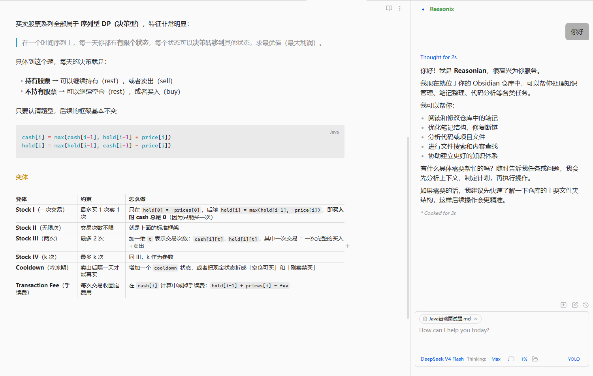

# Reasonian

[Reasonix](https://github.com/esengine/DeepSeek-Reasonix) 是 DeepSeek 原生的编程 Agent。  
**Reasonian** 将 Reasonix 嵌入到 Obsidian 的侧边栏中，让你在笔记库中直接获得 Agent 辅助：文件读写、搜索、Shell 命令、MCP 工具、多步工作流。

> 基于 [Claudian](https://github.com/YishenTu/claudian) (MIT License) 二次开发，将 Claude 后端替换为 Reasonix。



---

## 功能

- 💬 **侧边栏聊天** — 多标签页，支持流式输出、思考过程展示
- 🧠 **DeepSeek V4** — flash / pro 模型，支持 reasoning_effort 控制
- 🔧 **工具集** — 文件读写、Shell 命令、Web 搜索、MCP 服务器
- 📝 **行内编辑** — 在任意笔记中选中文本，直接让 Agent 修改
- 🎯 **Plan 模式** — 先制定计划再执行，安全可控
- 🔄 **会话持久化** — 消息保存到 vault，重启不丢失
- 🎨 **斜杠命令** — `/compact`、`/new`、`/model` 等内置命令
- 🌍 **国际化** — 10 种语言支持
- 🧩 **自定义系统提示词** — 设置页自由编辑 Agent 行为
- 💾 **长期记忆** — 通过 REASONIX.md 和用户记忆持久化跨会话知识

## 安装

> 插件尚未发布到 Obsidian 社区市场，请手动安装。

1. 下载最新 [Release](https://github.com/Reject-Reality/Reasonian/releases) 中的 `main.js`、`styles.css`、`manifest.json`
2. 在 vault 的 `.obsidian/plugins/reasonian/` 目录下放入上述三个文件
3. 重启 Obsidian
4. 设置 → 第三方插件 → 关闭安全模式 → 启用 **Reasonian**

---

## 配置

1. 打开 Obsidian 设置 → **Reasonian**
2. 填入 **API Key**（从 [DeepSeek Platform](https://platform.deepseek.com/api_keys) 获取）
3. 可选配置：
   - **模型选择**: `deepseek-v4-flash`（快速）/ `deepseek-v4-pro`（深度思考）
   - **推理强度**: low / medium / high
   - **自定义系统提示词**: 在每次对话的系统提示词末尾追加你的指令
   - **长期记忆**: 启用后自动注入 `REASONIX.md` 和 `~/.reasonix/memory/`
   - **默认模式**: Review（每次确认）/ YOLO（自动执行）/ Plan（先计划后执行）

---

## 架构

| 层 | 用途 | 详情 |
|---|---|---|
| **app** | 共享默认值和插件级存储辅助 | `defaultSettings`、`ClaudianSettingsStorage`、`SharedStorageService` |
| **core** | Provider 无关的核心契约 | 运行时、注册表、工具、类型定义 |
| **providers/reasonix** | Reasonix 运行时适配 | `ChatRuntime` 实现、会话服务、工具注册、UI 配置 |
| **features/chat** | 主侧边栏聊天界面 | `ClaudianView`、控制器、渲染器、状态管理 |
| **features/inline-edit** | 行内编辑模态框 | `InlineEditModal` |
| **features/settings** | 设置页面 | General + API 配置 + 系统提示词 |
| **shared** | 可复用的 UI 组件 | 下拉框、模态框、提及 UI、图标 |
| **i18n** | 国际化 | 10 种语言 |
| **utils** | 跨功能工具函数 | 编辑器、路径、Markdown、diff、上下文、图像 |
| **style** | 模块化 CSS | 组件、工具栏、特性、设置、模态框样式 |

---

## 存储路径

| 路径 | 内容 |
|---|---|
| `.reasonix/sessions/{id}.messages.json` | 对话消息持久化 |
| `.reasonix/settings.json` | Reasonian 插件设置 |
| `.reasonix/mcp.json` | MCP 服务器配置 |
| `.reasonix/commands/**/*.md` | 用户斜杠命令 |
| `.reasonix/skills/*/SKILL.md` | 用户技能 |
| `~/.reasonix/memory/` | 用户记忆（全局 + 按项目） |
| `REASONIX.md`（vault 根目录） | 项目记忆 |

---

## 开发

```bash
# 克隆 + 安装
git clone https://github.com/Reject-Reality/Reasonian.git
cd reasonian
npm install

# 先构建 Reasonix 依赖
cd ../DeepSeek-Reasonix
npm install --ignore-scripts
npx tsup src/index.ts --format esm --dts --clean --sourcemap --target node22 --outDir dist

# 回到 Reasonian 开发
cd ../reasonian
npm run dev         # 开发模式（watch + 自动构建）
npm run build       # 生产构建
npm run typecheck   # TypeScript 类型检查
npm run lint        # ESLint 检查
```

---

## 致谢

- [Claudian](https://github.com/YishenTu/claudian) — 本项目基于其卓越的 Obsidian 插件架构
- [Reasonix](https://github.com/esengine/DeepSeek-Reasonix) — DeepSeek 原生编程 Agent 引擎
- [DeepSeek](https://deepseek.com) — 高质量的 LLM API

## License

MIT
